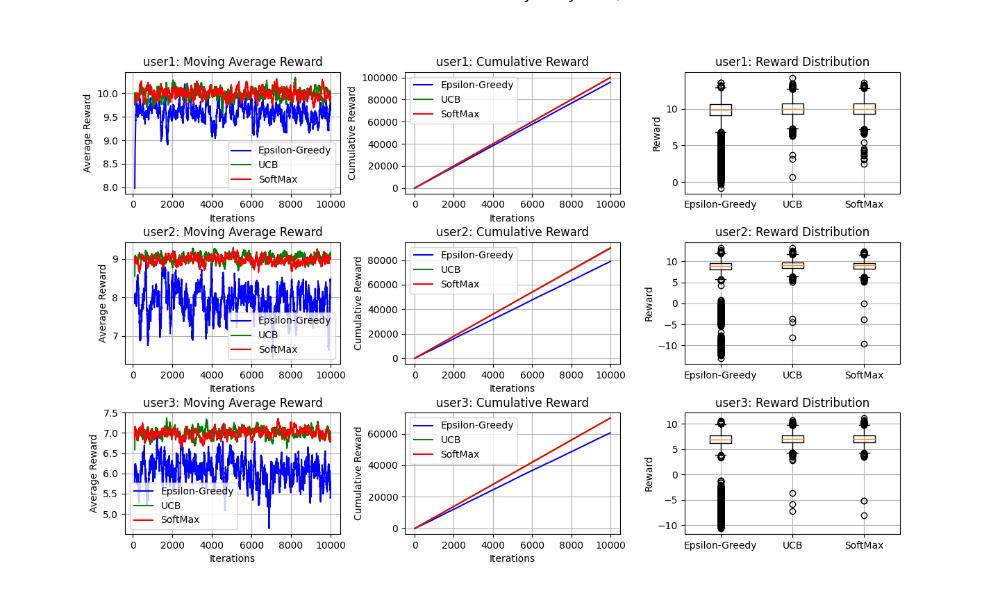
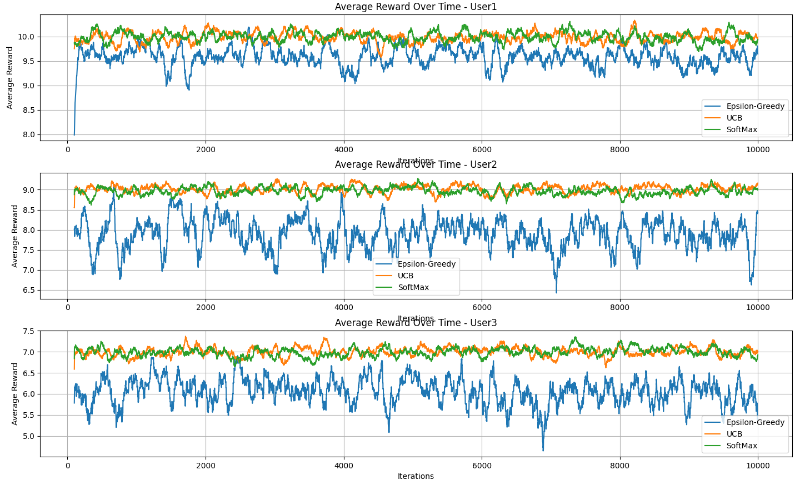
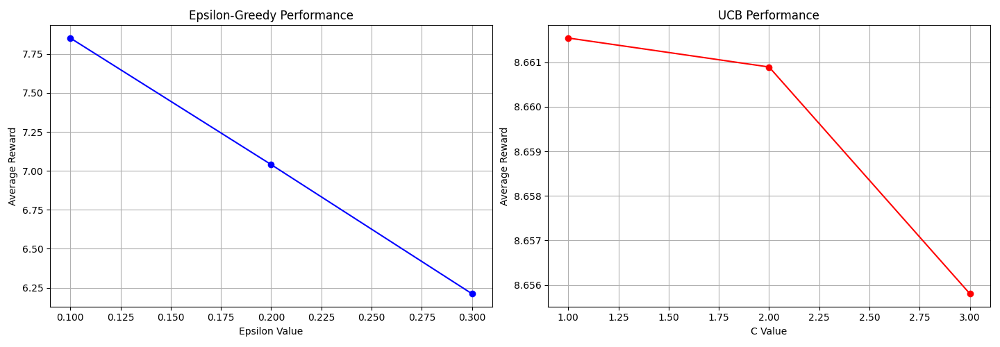

# RL Assignment 1

## Model Performance Analysis

### Reward Distribution by User Context

#### User 1 Performance

- **UCB**: Best performing with mean reward of 9.9996 (σ = 1.0192)
- **SoftMax**: Second best with mean reward of 9.7215 (σ = 1.2490)
- **Epsilon-Greedy**: Mean reward of 9.5985 (σ = 1.8677)

Key observation: UCB showed the most stable performance with lowest standard deviation.

#### User 2 Performance

- **UCB**: Highest mean reward of 9.0111 (σ = 1.0190)
- **SoftMax**: Close second with 8.9893 (σ = 1.0238)
- **Epsilon-Greedy**: Lowest performance with 7.9285 (σ = 3.9620)

Key observation: Significantly higher variance in Epsilon-Greedy strategy.

#### User 3 Performance

- **SoftMax**: Slightly better with 6.9954 (σ = 1.0310)
- **UCB**: Very close at 6.9918 (σ = 1.0220)
- **Epsilon-Greedy**: Significantly lower at 6.0754 (σ = 3.5100)

Key observation: Overall lower rewards compared to other user contexts.

### Convergence Analysis

None of the models achieved convergence within 10,000 iterations, suggesting:

1. The exploration space might be large
2. More iterations might be needed
3. The reward landscape might be complex

### Overall Model Comparison

1. **UCB Strategy**

   - Most consistent performance across contexts
   - Lowest standard deviation
   - Highest mean rewards

2. **SoftMax Strategy**

   - Very close performance to UCB
   - More stable than Epsilon-Greedy
   - Good balance of exploration and exploitation

3. **Epsilon-Greedy Strategy**
   - Highest variance in rewards
   - Generally lower mean rewards
   - Most affected by context changes

## Classification Performance

The user classification model achieved an accuracy of 33.40%, which is relatively low. This suggests:

1. Potential for trying different classification algorithms
2. Possible room for hyperparameter optimization

## Content Categories

The system successfully mapped between recommended categories and actual dataset categories. Notable observations:

- Case-sensitive matching was implemented
- Wide variety of categories available (41 unique categories)

## Recommendations for Improvement

1. **Model Enhancements**:

   - Increase training iterations beyond 10,000
   - Try different temperature values for SoftMax
   - Experiment with different epsilon values
   - Implement contextual Thompson Sampling

2. **Classification Improvements**:

   - Feature engineering
   - Try ensemble methods
   - Implement cross-validation
   - Consider deep learning approaches

3. **System Optimization**:
   - Implement batch updates
   - Add real-time learning capabilities
   - Consider multi-armed bandit approaches

## Conclusion

The UCB strategy demonstrated the most robust performance across all user contexts, while the Epsilon-Greedy strategy showed the highest variance. The system successfully recommended articles but could benefit from improved user classification accuracy and longer training periods.
